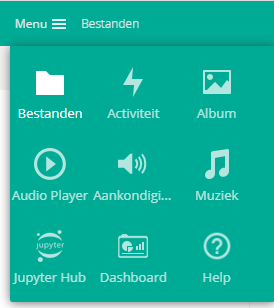

# SURF Research Drive: General information

Note: this is a general introduction to Research Drive. For more specific instructions, to go [the next chapter](./research-drive-how.md) or visit the official [Research Drive wiki](https://wiki.surfnet.nl/display/RDRIVE).

## What is SURF Research Drive?

Research Drive is a cloud environment offered by SURF and used by Erasmus University Rotterdam to **store research data during** the active research phase. It is **not** meant for long-term archiving, data publishing or data analysis! You can compare it to Google Drive, but for teams:

- files are stored in the **cloud**, can be shared and **collaboratively** edited
- data are stored in the Netherlands (backed-up weekly) 
- there is **no personal storage**, only team storage (storage per project) - data will always be part of a project and remain accessible, even when users leave or permissions are changed
- there are several **integrations** with other applications and environments (LISA cluster, Jupyter Hub, HPC cloud, OwnCloud, OnlyOffice, etc.).

## Roles

Each project gets a storage quotum and a data steward. The data steward gives rights to end-users. If permitted, end-users can upload data in the folders they received rights to. 

Roles within Research Drive:

<ul>
    <li><strong>Site administrator</strong>: manager of the entire (EUR-)instance > usually someone from SURF</li>
    <li><strong>Dashboard administrator</strong>: manages all contracts, can add new contracts and assigns contract administrators > someone from EUR</li>
    <li><strong>Contract administrator/owner</strong>: manages a contract that has a specific amount of storage available to divide over the projects under the contract:
    <ul>
        <li> can create project folders including a storage quotum and data steward</li>
        <li>does <strong>not</strong> automatically have access to the created projects</li>
        </ul>
    </li>
    <li><strong>Data steward</strong>: responsible for specific project(s):
    <ul>
        <li>gives rights to members or groups by permissions on folder level</li>
        <li>can invite new members</li>
        <li>can always see all project contents</li>
        </ul></li>
    <li><strong>Member</strong>: normal end-user, <strong>anyone</strong> can add new members by sending invitations (but data stewards have to give them permissions)</li>
</ul>

## Sharing files and folders

Data stewards can give the following permissions to users:

<ul>
    <li><strong>Read-only</strong>: keep in mind that copying data to a local machine is always possible</li>
    <li><strong>Write</strong>:
    <ul>
        <li>Create: create and add new items and rename existing folders</li>
        <li>Change: upload and replace existing items in the folder</li>
        <li>Delete: delete existingg items in the folder</li>
        </ul></li>
    <li><strong>Share</strong>: re-share the item or a child item. If users have this right, they can set (perhaps broader) permissions for other users. This is <strong>not</strong> recommended, since you can quickly lose overview of who has access to which data. This way, the data steward remains in control of the data.</li>
</ul>

 

Folders and/or files can be shared in the following ways:

<ul>
    <li><strong>Existing users</strong> (search for the email address or user name)</li>
    <li>A <strong>custom group</strong> (Settings > Custom groups): you can add users to a custom group and then set permissions for the entire group. All users in that group then have the <strong>same</strong> permissions.</li>
    <ul>
        <li>Others cannot see who is in the group, but</li>
        <li>Anyone in Research Drive can find a group name, so make a  <strong>well-defined, distinguishing</strong> group name, e.g., "SYNC_Brainlinks_edit"</li>
    </ul>
    <li>A <strong>SURFdrive user</strong>:  if someone uses SURFdrive via their institution, they don't need a new Research Drive account. You can simply share the files or folders with their <strong>federated cloud ID</strong>, click <a href="https://wiki.surfnet.nl/pages/viewpage.action?pageId=11219960">here</a> for how to do this. </li>
    <li>A <strong>new user</strong>: Dashboard > New user. The new user can choose 2 types of accounts:</li>
    <ul>
        <li>Organization: recommended if the user has a SURFconext account (e.g., because they work at a different university)</li>
        <li>Local: if the user does not have a SURFconext account, choose this option</li>
    </ul>
    After the user has an account, the data stewards needs to add the new user to the relevant folder(s).
    <li><strong>Non users: public link</strong>: everyone with a link gets the specified permissions. You can set an expiry date, password and permissions. A great option here is the <strong>drop file function</strong>: partners can put files in the project folder but cannot see or download the contents of the other partners (“write-only”).</li>
</ul>

 

**Important notes on sharing**

- Permissions are inherited from parent folders, unless they are specifically changed (e.g., during re-sharing): giving access to a folder means giving access to all subfolders as well!
- A user with whom subfolders are shared **cannot** see the parent folders. Make understandable folder names if you plan to share subfolders (e.g., not "Students", but "Brainlinks_Students") 
- Specific subfolder permissions **overrule** higher-level permissions
- A share name **can be renamed individually**. This is invisible to original sharer (data steward). However, the contents of the folder remain the same and visible to all. 

 

## Interface

When you log into Research Drive, you will automatically see an overview of Projects / folders of which you are data steward or member. These files can be accessed in the **Menu** in the upper left corner, as are Applications and the Dashboard:

  

#### **Dashboard**

The Dashboard is accessible to anyone, but only relevant data will be shown.

- **Users** can only invite new users. Under "User accounts", click "Invite user". For each user, you can view their Project membership, contract details, storage overview and service overview (available apps can be added here too). After account removal, the account will exist for 30 days. 

  

- **Data stewards** can invite new users and additionally have an overview of project folders and user accounts 

  

- **Contract administrators** can invite new users and have overview of project folders, but they can also add new and edit existing project folders and see the contract details.

    
     

#### Settings

Settings can be found on the top right of the screen:

  

The most important settings are:

- **General**: here, you can find your account details, federated cloud ID and links to external apps
- **Security**: contains, among others, your saved encryption keys (if any) and Webdav passwords
- **Custom groups**: here, you can make new custom groups and add users to them. Note that every EUR instance Research Drive user can find this group, so aptly name them!

## Version control

- New versions of single files are automatically stored: any version older than two weeks will be removed
- When you are working on the same file simultaneously and **not** in your internet browser, the **last saved file** will be the version stored. However, you can restore previous versions via the **Versions** tab.
- Deleted files are moved to the **trash bin**. They will be removed after 30 days and can be restored from here during this period. Retention periods can be configured.
- To prevent syncing issues, make a copy first or work on local files (only copy what you need)

## Further reading

- Official [Research Drive wiki](https://wiki.surfnet.nl/display/RDRIVE)
- [Slides](https://surfdrive.surf.nl/files/index.php/s/7HBbzSxKbK1c5cr) for end-users
- Hands-on [exercises for end-users](https://surfdrive.surf.nl/files/index.php/s/7LmzSGz9Dgd1F3t)
- Slides for [data stewards](https://surfdrive.surf.nl/files/index.php/s/bVsuqPUKYttBmjB )
- Link for logging on in the [demo environment](https://demo.data.surfsara.nl/index.php/login) 