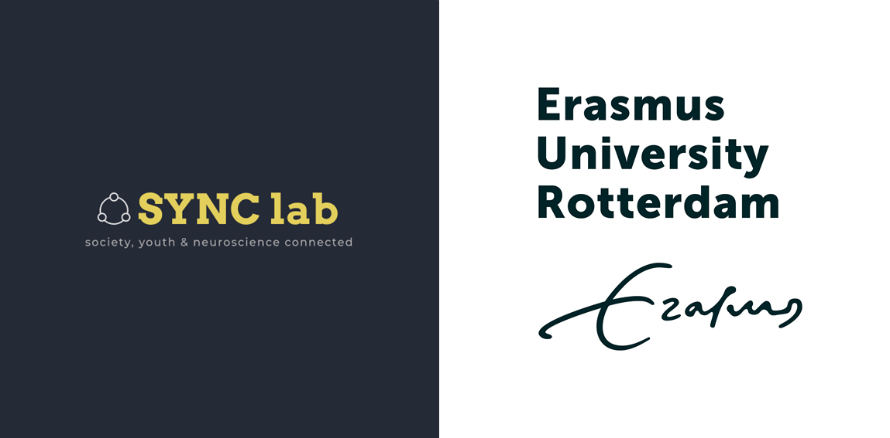

# The SYNC email signature

## Setting your email signature in Outlook

- Log in via [Outlook](https://outlook.office.com/mail/inbox) using your ERNA-ID
- At the top right of your screen, click the "Settings"  wheel > “View all Outlook settings”
- In the Settings, choose "Mail" > “Compose and reply”
- In the box under “Email signature”, make your email signature.
- Configure when to use the signature: in original emails only or also when replying to emails?
- Click "Save"

For EUR-wide email templates, see [this link](https://my.eur.nl/en/eur-employee/work-support/marketing-and-communication/branding/brand-elements/email-signature). For the EUR-specific color codes, see [this webpage](https://www.eur.nl/en/about-eur/house-style/brand-elements/colours) (the ESSB HEX code is #ff9e00).

 

## Individual email signature

**Name, title**  
Function

<strong>SYNC lab: Society, Youth and Neuroscience Connected</strong> 
Erasmus School of Social and Behavioral Sciences

<strong>E:</strong> <a href=youremailaddress@essb.eur.nl>youremailaddress@eur.nl</a> / <a href=yoursecondemailaddress@essb.eur.nl>yoursecondemailaddress@eur.nl</a> 
<strong>W:</strong> <a href=http://erasmus-synclab.nl/>http://erasmus-synclab.nl/ </a> 
<strong>A:</strong> Mandeville building, T13 room x / Burgemeester Oudlaan 50 / 3062 PA Rotterdam, the Netherlands  

Present: Days present

  

 

## Lab email signature

<strong>SYNC lab: Society, Youth and Neuroscience Connected</strong> 
Erasmus School of Social and Behavioral Sciences

<strong>E:</strong> <a href=synclab@essb.eur.nl>synclab@essb.eur.nl</a> 
<strong>W:</strong> <a href=http://erasmus-synclab.nl/>http://erasmus-synclab.nl/ </a> 
<strong>T:</strong> <a href=https://twitter.com/SYNClabEUR/>https://twitter.com/SYNClabEUR</a> 
<strong>A:</strong> Mandeville building, T13 / Burgemeester Oudlaan 50 / 3062 PA Rotterdam, the Netherlands  

  

