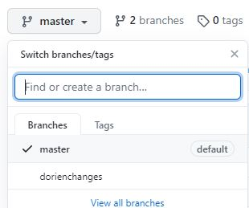

# How to contribute

This lab wiki was built using:

- **Git**: a version control system, which allows us to go back to previous versions of the web pages at all times;
- On **Github**, a platform that hosts files that use git as a version control system and on which we can collaborate on the wiki;
- Relying on [**Mkdocs**](https://www.mkdocs.org/), a simply static site generator which generates html pages (web pages) from .md (markdown) files. 

 

## Installation

- Create a [Github account](https://github.com/join) (or log on)
- Install [git locally](https://git-scm.com/download/) (click here for [instructions for RStudio](http://www.geo.uzh.ch/microsite/reproducible_research/post/rr-rstudio-git/)) and some Markdown editor (see below)

 

**For an introduction to Git(hub), please see the [version control chapter](../data-management/vc-github.md).**

 

## Markdown

Markdown is a markup language that you can use to add formatting elements to plaintext text documents. When you create a Markdown-formatted file, you add Markdown syntax to the text to indicate which words and phrases should look different. Every .md (Markdown) file in this repository in fact uses Markdown for formatting!

For example, to indicate a second-level header, you type: `## Title of header`

Advantages of Markdown:

- It can be used for a lot of things, e.g., for creating html pages
- It is platform- and operating system independent
- You can type markdown in any text editor and open .md files with many programs, such as [Atom](https://atom.io/), [Zettlr](https://www.zettlr.com/), [Rstudio](https://rstudio.com/), [Typora](https://typora.io/), online (e.g.,[Dillinger](https://dillinger.io/)) or even in Word ([Writage tool](http://www.writage.com/)). See [this page]( https://www.markdownguide.org/tools/) for more tools that support Markdown.

**Markdown resources**

- [Markdown guide](https://www.markdownguide.org/getting-started/)
- [Cheatsheet](https://www.markdownguide.org/cheat-sheet/)
- [More advanced Markdown tricks](https://gist.github.com/apaskulin/1ad686e42c7165cb9c22f9fe1e389558)

## Contributing step-by-step
#### **A. The easy (but not recommended) way**
1. `fork` the repository to your own Github account by clicking the button on the upper right of the repository: 

2. Make edits to the files you want to edit in your browser by clicking the pencil at the top right of a file. All editable .md files can be found in the `docs` folder

    

3.  Write a commit message for your changes and click `Commit changes`.

4. After having made all the changes you wanted, go to the tab `Pull requests` > `New pull request`. 

   

5. Make sure the base repository is `eur-synclab/sync-manual` `master` and head repository is your own repository, e.g., `DorienHuijser/sync-manual` `branchinwhichyoumadechanges`. 

6. Click `Create pull request`

7. Your pull request will now appear in the [eur-synclab repository list of pull requests](https://github.com/eur-synclab/sync-manual/pulls). If you want, you can assign someone to review your pull request. One of the owners of the repository will review your commits, may request changes and will finally approve the pull request and merge your changes into the eur-synclab/sync-manual master branch.

 

#### **B. The better way**
1. `fork` the repository to your own Github account by clicking the button on the upper right of the repository: 
2. Create a new branch in your forked repository which you will use to make changes in (so your master branch will stay"clean"): 
3. `clone` your forked repository to your local PC ([using the command-line](https://help.github.com/en/github/creating-cloning-and-archiving-repositories/cloning-a-repository) or [Rstudio](https://happygitwithr.com/rstudio-git-github.html#clone-the-new-github-repository-to-your-computer-via-rstudio))
4. Make local changes. You can open a .md file in the `docs` folder with multiple text editors such as Typora, Atom, Zettlr, Rstudio, etc.) and, after saving your changes, **commit** them ([command-line](https://www.git-tower.com/learn/git/commands/git-commit): `git commit -a -m "commit message"`, [RStudio](https://cfss.uchicago.edu/setup/git-with-rstudio/). Your changes are now saved locally.
5. Push your commits to your “remote” (online) repository ([using the command-line](https://www.earthdatascience.org/workshops/intro-version-control-git/basic-git-commands/): `git push origin branchname`, [in Rstudio](https://happygitwithr.com/rstudio-git-github.html#make-local-changes-save-commit))
6. Follow steps 4-7 explained in the Easy way
7. Important: the next time you start working locally, **first update your local version of the repository** to the most recent version (Command line: `git pull upstream [branchname]` [be sure to [set the upstream repository](https://docs.github.com/en/github/collaborating-with-issues-and-pull-requests/configuring-a-remote-for-a-fork) first], [RStudio](https://happygitwithr.com/upstream-changes.html)).

#### **C. The most advanced way**

1. Follow the installation steps for mkdocs [here](https://www.mkdocs.org/#installation)
2. Follow steps 1-4 explained in The better way
3. In your **prompt**, navigate to your repository directory with `cd C:/users/username/your/repo/directory` and run `mkdocs serve`. This creates a URL (something like http://127.0.0.1:8000/) which you can open in your internet browser. Here, you can see all changes that you make directly "live". Press Cntrl+C to stop this operation.
4. Run `mkdocs build`. If everything goes correctly, you can now also open the new .html files in the `sync-manual/site` folder to see what your changes will look like in the browser. These files have to be created in order for the website to work on others' computers.
5. `commit `your newly built website (html) files, e.g., `git commit -A . "Build site"`
6. Follow step 5-7 explained in The better way.

 

#### **Add yourself as a contributor!**

- Go to [this Github issue](https://github.com/eur-synclab/sync-manual/issues/5).
- Type a comment asking the **all-contributors bot** to add you (use template mentioned in the issue), look for appropriate emojis [here](https://allcontributors.org/docs/en/emoji-key).
- The bot will open a pull request to add you as contributor. After merging with the master branch, your face will appear in the [README.md](https://github.com/eur-synclab/sync-manual/blob/master/README.md)!

 

#### **Issues and Projects**
If you would like to see a change that requires more work or input from others before you can start editing yourself, you can open an [**Issue**.](https://github.com/eur-synclab/sync-manual/issues) There are some great features about Issues:

- You can assign people to the Issue who should solve it or provide input
- You can add the issue to a project. In the tab [Projects](https://github.com/eur-synclab/sync-manual/projects/), you can find our [Kanban board](https://github.com/eur-synclab/sync-manual/projects/1) in which we have made the columns  “To do”, “In progress” and “Done”. We made this so we have an overview of Issues that still need work and issues that are in progress.
- You can add labels to an Issue (please do so!) to specify what kind of issue you are writing
- After the issue has been solved, you can Close it manually. However, if you made a pull request that  solves the issue, you can simply comment `Closes #issuenr` in the pull request. After the pull request has been merged, the issue is automatically closed!
